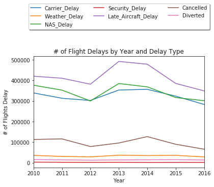
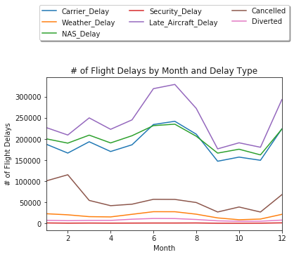
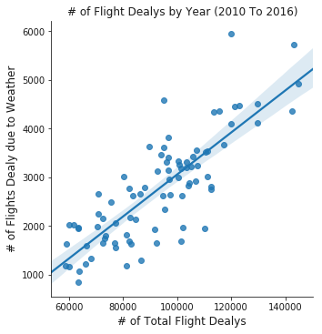
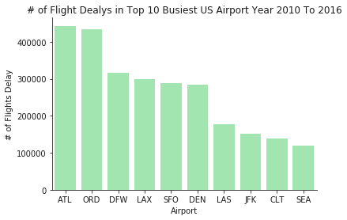

```python
import unicodecsv
import pandas as pd
import numpy as np
import matplotlib.pyplot as plt
import seaborn as sns
import datetime as dt
from scipy import stats
from scipy.stats import norm

pd.options.display.float_format = '{:.0f}'.format
```


```python
flights = pd.read_csv("Data/FlightDelays.csv")

len(flights)
```


    103361


```python
flights.columns
```


    Index(['year', ' month', 'carrier', 'carrier_name', 'airport', 'airport_name',
           'arr_flights', 'arr_del15', 'carrier_ct', ' weather_ct', 'nas_ct',
           'security_ct', 'late_aircraft_ct', 'arr_cancelled', 'arr_diverted',
           ' arr_delay', ' carrier_delay', 'weather_delay', 'nas_delay',
           'security_delay', 'late_aircraft_delay', 'Unnamed: 21'],
          dtype='object')


```python
flights.info()

flights["carrier"] = flights["carrier"].astype("category")
flights["carrier_name"] = flights["carrier_name"].astype("category")
flights["airport"] = flights["airport"].astype("category")
flights["airport_name"] = flights["airport_name"].astype("category")
```

    <class 'pandas.core.frame.DataFrame'>
    RangeIndex: 103361 entries, 0 to 103360
    Data columns (total 22 columns):
    year                   103361 non-null int64
     month                 103361 non-null int64
    carrier                103361 non-null object
    carrier_name           103361 non-null object
    airport                103361 non-null object
    airport_name           103361 non-null object
    arr_flights            103240 non-null float64
    arr_del15              103220 non-null float64
    carrier_ct             103240 non-null float64
     weather_ct            103240 non-null float64
    nas_ct                 103240 non-null float64
    security_ct            103240 non-null float64
    late_aircraft_ct       103240 non-null float64
    arr_cancelled          103240 non-null float64
    arr_diverted           103240 non-null float64
     arr_delay             103240 non-null float64
     carrier_delay         103240 non-null float64
    weather_delay          103240 non-null float64
    nas_delay              103240 non-null float64
    security_delay         103240 non-null float64
    late_aircraft_delay    103240 non-null float64
    Unnamed: 21            0 non-null float64
    dtypes: float64(16), int64(2), object(4)
    memory usage: 17.3+ MB


```python
flights.drop([' arr_delay'], axis=1, inplace=True)
flights.drop([' carrier_delay'], axis=1, inplace=True)
flights.drop(['weather_delay'], axis=1, inplace=True)
flights.drop(['nas_delay'], axis=1, inplace=True)
flights.drop(['security_delay'], axis=1, inplace=True)
flights.drop(['late_aircraft_delay'], axis=1, inplace=True)
```


```python
flights.info()
flights.head()
```

    <class 'pandas.core.frame.DataFrame'>
    RangeIndex: 103361 entries, 0 to 103360
    Data columns (total 16 columns):
    year                103361 non-null int64
     month              103361 non-null int64
    carrier             103361 non-null category
    carrier_name        103361 non-null category
    airport             103361 non-null category
    airport_name        103361 non-null category
    arr_flights         103240 non-null float64
    arr_del15           103220 non-null float64
    carrier_ct          103240 non-null float64
     weather_ct         103240 non-null float64
    nas_ct              103240 non-null float64
    security_ct         103240 non-null float64
    late_aircraft_ct    103240 non-null float64
    arr_cancelled       103240 non-null float64
    arr_diverted        103240 non-null float64
    Unnamed: 21         0 non-null float64
    dtypes: category(4), float64(10), int64(2)
    memory usage: 10.1 MB


<div>
<style>
    .dataframe thead tr:only-child th {
        text-align: right;
    }

    .dataframe thead th {
        text-align: left;
    }

    .dataframe tbody tr th {
        vertical-align: top;
    }
</style>
<table border="1" class="dataframe">
  <thead>
    <tr style="text-align: right;">
      <th></th>
      <th>year</th>
      <th>month</th>
      <th>carrier</th>
      <th>carrier_name</th>
      <th>airport</th>
      <th>airport_name</th>
      <th>arr_flights</th>
      <th>arr_del15</th>
      <th>carrier_ct</th>
      <th>weather_ct</th>
      <th>nas_ct</th>
      <th>security_ct</th>
      <th>late_aircraft_ct</th>
      <th>arr_cancelled</th>
      <th>arr_diverted</th>
      <th>Unnamed: 21</th>
    </tr>
  </thead>
  <tbody>
    <tr>
      <th>0</th>
      <td>2010</td>
      <td>1</td>
      <td>9E</td>
      <td>Pinnacle Airlines Inc.</td>
      <td>ABE</td>
      <td>Allentown/Bethlehem/Easton, PA: Lehigh Valley ...</td>
      <td>65</td>
      <td>16</td>
      <td>5</td>
      <td>0</td>
      <td>11</td>
      <td>0</td>
      <td>0</td>
      <td>1</td>
      <td>0</td>
      <td>nan</td>
    </tr>
    <tr>
      <th>1</th>
      <td>2010</td>
      <td>1</td>
      <td>9E</td>
      <td>Pinnacle Airlines Inc.</td>
      <td>AEX</td>
      <td>Alexandria, LA: Alexandria International</td>
      <td>60</td>
      <td>17</td>
      <td>5</td>
      <td>0</td>
      <td>8</td>
      <td>0</td>
      <td>4</td>
      <td>4</td>
      <td>0</td>
      <td>nan</td>
    </tr>
    <tr>
      <th>2</th>
      <td>2010</td>
      <td>1</td>
      <td>9E</td>
      <td>Pinnacle Airlines Inc.</td>
      <td>ALB</td>
      <td>Albany, NY: Albany International</td>
      <td>81</td>
      <td>34</td>
      <td>10</td>
      <td>1</td>
      <td>20</td>
      <td>0</td>
      <td>3</td>
      <td>1</td>
      <td>1</td>
      <td>nan</td>
    </tr>
    <tr>
      <th>3</th>
      <td>2010</td>
      <td>1</td>
      <td>9E</td>
      <td>Pinnacle Airlines Inc.</td>
      <td>ALO</td>
      <td>Waterloo, IA: Waterloo Regional</td>
      <td>3</td>
      <td>1</td>
      <td>0</td>
      <td>0</td>
      <td>1</td>
      <td>0</td>
      <td>0</td>
      <td>0</td>
      <td>0</td>
      <td>nan</td>
    </tr>
    <tr>
      <th>4</th>
      <td>2010</td>
      <td>1</td>
      <td>9E</td>
      <td>Pinnacle Airlines Inc.</td>
      <td>ATL</td>
      <td>Atlanta, GA: Hartsfield-Jackson Atlanta Intern...</td>
      <td>1067</td>
      <td>271</td>
      <td>43</td>
      <td>9</td>
      <td>156</td>
      <td>0</td>
      <td>63</td>
      <td>46</td>
      <td>4</td>
      <td>nan</td>
    </tr>
  </tbody>
</table>
</div>


```python
flights = flights.rename(columns={' month': 'Month', 'arr_del15': 'Arrival_Delay', 'carrier_ct':'Carrier_Delay', ' weather_ct': 'Weather_Delay',
                        'nas_ct': 'NAS_Delay', 'security_ct': "Security_Delays", 'late_aircraft_ct': 'Late_Aircraft_Delay', 
                        'arr_cancelled': 'Cancelled', 'arr_diverted': 'Diverted',
                        'year': 'Year'
                       }
              )
```


```python
flights = flights.rename(columns={'Security_Delays' :"Security_Delay"})
```


```python
df2 = flights.groupby('Year')['Carrier_Delay', 'Weather_Delay', 'NAS_Delay', 'Security_Delay','Late_Aircraft_Delay','Cancelled','Diverted'].sum().plot()
df2.legend(loc='upper center', bbox_to_anchor=(0.5, 1.5), ncol=3, fancybox=True, shadow=True)
plt.xlabel('Year')
plt.ylabel('# of Flights Delay')
plt.title('# of Flight Delays by Year and Delay Type')
plt.show()
```





```python
df2 = flights.groupby('Month')['Carrier_Delay', 'Weather_Delay', 'NAS_Delay', 'Security_Delay','Late_Aircraft_Delay','Cancelled','Diverted'].sum().plot()
df2.legend(loc='upper center', bbox_to_anchor=(0.5, 1.5), ncol=3, fancybox=True, shadow=True)
plt.xlabel('Month')
plt.ylabel('# of Flight Delays')
plt.title('# of Flight Delays by Month and Delay Type')
plt.show()
```





```python
vis1 = sns.lmplot(data=flights, x="Weather_Delay", y="NAS_Delay", fit_reg=False,hue="Month", size=6, aspect=1)
```


```python
df2 = flights.groupby(['Year', 'Month'])['Arrival_Delay','Carrier_Delay', 'Weather_Delay', 'NAS_Delay', 'Security_Delay','Late_Aircraft_Delay','Cancelled','Diverted'].sum()

df3 = df2.reset_index()

#vis1 = sns.lmplot(data=df3, x="Arrival_Delay", y="Weather_Delay", hue = "Year", col="Year", x_jitter=.1)
vis1 = sns.lmplot(data=df3, x="Arrival_Delay", y="Weather_Delay", x_jitter=.1)
plt.gca()
plt.title("# of Flight Dealys by Year (2010 To 2016)")
plt.xlabel("# of Total Flight Dealys", fontsize=12)
plt.ylabel("# of Flights Dealy due to Weather", fontsize=12)


plt.show()
```





```python
genlist = []
mylabels = []

for gen in df3["Year"].cat.categories:
    genlist.append(df3[df3["Year"] == gen]["Arrival_Delay"])
    mylabels.append(gen)
plt.hist(genlist, stacked = True, bins=10, rwidth=1, label=mylabels)
plt.legend()
plt.show()
```


    ---------------------------------------------------------------------------

    AttributeError                            Traceback (most recent call last)

    <ipython-input-13-22346d353d0f> in <module>()
          2 mylabels = []
          3 
    ----> 4 for gen in df3["Year"].cat.categories:
          5     genlist.append(df3[df3["Year"] == gen]["Arrival_Delay"])
          6     mylabels.append(gen)


    ~/anaconda/envs/PythonData/lib/python3.6/site-packages/pandas/core/generic.py in __getattr__(self, name)
       3075         if (name in self._internal_names_set or name in self._metadata or
       3076                 name in self._accessors):
    -> 3077             return object.__getattribute__(self, name)
       3078         else:
       3079             if name in self._info_axis:


    ~/anaconda/envs/PythonData/lib/python3.6/site-packages/pandas/core/base.py in __get__(self, instance, owner)
        241             # this ensures that Series.str.<method> is well defined
        242             return self.accessor_cls
    --> 243         return self.construct_accessor(instance)
        244 
        245     def __set__(self, instance, value):


    ~/anaconda/envs/PythonData/lib/python3.6/site-packages/pandas/core/series.py in _make_cat_accessor(self)
       2831     def _make_cat_accessor(self):
       2832         if not is_categorical_dtype(self.dtype):
    -> 2833             raise AttributeError("Can only use .cat accessor with a "
       2834                                  "'category' dtype")
       2835         return CategoricalAccessor(self.values, self.index)


    AttributeError: Can only use .cat accessor with a 'category' dtype


```python
z = sns.boxplot(data=df3, x='Year', y='NAS_Delay')
z.set(xlabel='Year', ylabel='# of Flight Delays')
plt.show()
```


```python
z = sns.boxplot(data=df3, x='Year', y='Arrival_Delay')
z.set(xlabel='Year', ylabel='# of Flight Delays')
plt.show()
```


```python
z = sns.boxplot(data=df3, x='Year', y='Arrival_Delay')
z.set(xlabel='Year', ylabel='# of Flights Delay')
z.set_title('# of Flight Dealys by Year (2010 To 2016)')
plt.show()
```


```python
z = sns.violinplot(data=df3, x='Year', y='Arrival_Delay')
z.set(xlabel='Year', ylabel='# of Flight Delays')
z.set_title('# of Flight Dealys by Year(2010 To 2016)')
plt.show()

```


```python
flights_airport = flights.groupby(['airport'])['Arrival_Delay','Carrier_Delay', 'Weather_Delay', 'NAS_Delay', 'Security_Delay','Late_Aircraft_Delay','Cancelled','Diverted'].sum()

flights_airport_noindex = flights_airport.reset_index()

flights_top10_airport = flights_airport_noindex[flights_airport_noindex['airport'].isin(['ATL','LAX', 'ORD', 'DFW', 'JFK', 'DEN','SFO','LAS', 'CLT', 'SEA'])]

#flights_top10_airport = flights_airport_noindex[flights_airport_noindex['Year'].isin(['2010','2011'])]

flights_top10_airport["airport"] = flights_top10_airport["airport"].astype("str")

flights_top10_airport_sorted = flights_top10_airport.sort_values('Arrival_Delay',ascending=False)

sns.set_color_codes("pastel")

#, order=flights_top10_airport["airport"]

z = sns.barplot(x= "airport", y="Arrival_Delay", data=flights_top10_airport_sorted, label="Total", color="g")
z.set(xlabel='Airport', ylabel='# of Flights Delay')
z.set_title('# of Flight Dealys in Top 10 Busiest US Airport Year 2010 To 2016')
sns.despine()
plt.show()
```

    /Users/ashishshrivastava/anaconda/envs/PythonData/lib/python3.6/site-packages/ipykernel_launcher.py:9: SettingWithCopyWarning: 
    A value is trying to be set on a copy of a slice from a DataFrame.
    Try using .loc[row_indexer,col_indexer] = value instead
    
    See the caveats in the documentation: http://pandas.pydata.org/pandas-docs/stable/indexing.html#indexing-view-versus-copy
      if __name__ == '__main__':





```python
sns.boxplot(x="numyear", y="numgrade", hue="numdept", data=dtest,
            hue_order=dtest.numdept.unique().sort(), width=0.2)
```
