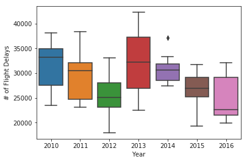
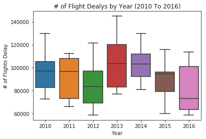

```python
import unicodecsv
import pandas as pd
import numpy as np
import matplotlib.pyplot as plt
import seaborn as sns
import datetime as dt
from scipy import stats
from scipy.stats import norm

pd.options.display.float_format = '{:.0f}'.format
```


```python
flights = pd.read_csv("FlightDelays.csv")

len(flights)
```


    103361


```python
flights.columns
```


    Index(['year', ' month', 'carrier', 'carrier_name', 'airport', 'airport_name',
           'arr_flights', 'arr_del15', 'carrier_ct', ' weather_ct', 'nas_ct',
           'security_ct', 'late_aircraft_ct', 'arr_cancelled', 'arr_diverted',
           ' arr_delay', ' carrier_delay', 'weather_delay', 'nas_delay',
           'security_delay', 'late_aircraft_delay', 'Unnamed: 21'],
          dtype='object')


```python
flights.info()

flights["carrier"] = flights["carrier"].astype("category")
flights["carrier_name"] = flights["carrier_name"].astype("category")
flights["airport"] = flights["airport"].astype("category")
flights["airport_name"] = flights["airport_name"].astype("category")
```

    <class 'pandas.core.frame.DataFrame'>
    RangeIndex: 103361 entries, 0 to 103360
    Data columns (total 22 columns):
    year                   103361 non-null int64
     month                 103361 non-null int64
    carrier                103361 non-null object
    carrier_name           103361 non-null object
    airport                103361 non-null object
    airport_name           103361 non-null object
    arr_flights            103240 non-null float64
    arr_del15              103220 non-null float64
    carrier_ct             103240 non-null float64
     weather_ct            103240 non-null float64
    nas_ct                 103240 non-null float64
    security_ct            103240 non-null float64
    late_aircraft_ct       103240 non-null float64
    arr_cancelled          103240 non-null float64
    arr_diverted           103240 non-null float64
     arr_delay             103240 non-null float64
     carrier_delay         103240 non-null float64
    weather_delay          103240 non-null float64
    nas_delay              103240 non-null float64
    security_delay         103240 non-null float64
    late_aircraft_delay    103240 non-null float64
    Unnamed: 21            0 non-null float64
    dtypes: float64(16), int64(2), object(4)
    memory usage: 17.3+ MB


```python
#flights.drop([' arr_delay'], axis=1, inplace=True)
#flights.drop([' carrier_delay'], axis=1, inplace=True)
#flights.drop(['weather_delay'], axis=1, inplace=True)
#flights.drop(['nas_delay'], axis=1, inplace=True)
#flights.drop(['security_delay'], axis=1, inplace=True)
#flights.drop(['late_aircraft_delay'], axis=1, inplace=True)
```


```python
flights.info()
```

    <class 'pandas.core.frame.DataFrame'>
    RangeIndex: 103361 entries, 0 to 103360
    Data columns (total 22 columns):
    year                   103361 non-null int64
     month                 103361 non-null int64
    carrier                103361 non-null category
    carrier_name           103361 non-null category
    airport                103361 non-null category
    airport_name           103361 non-null category
    arr_flights            103240 non-null float64
    arr_del15              103220 non-null float64
    carrier_ct             103240 non-null float64
     weather_ct            103240 non-null float64
    nas_ct                 103240 non-null float64
    security_ct            103240 non-null float64
    late_aircraft_ct       103240 non-null float64
    arr_cancelled          103240 non-null float64
    arr_diverted           103240 non-null float64
     arr_delay             103240 non-null float64
     carrier_delay         103240 non-null float64
    weather_delay          103240 non-null float64
    nas_delay              103240 non-null float64
    security_delay         103240 non-null float64
    late_aircraft_delay    103240 non-null float64
    Unnamed: 21            0 non-null float64
    dtypes: category(4), float64(16), int64(2)
    memory usage: 14.8 MB


```python
flights = flights.rename(columns={' month': 'Month', 'arr_del15': 'Arrival_Delay', 'carrier_ct':'Carrier_Delay', ' weather_ct': 'Weather_Delay',
                        'nas_ct': 'NAS_Delay', 'security_ct': "Security_Delays", 'late_aircraft_ct': 'Late_Aircraft_Delay', 
                        'arr_cancelled': 'Cancelled', 'arr_diverted': 'Diverted',
                        'year': 'Year'
                       }
              )
```


```python
flights = flights.rename(columns={'Security_Delays' :"Security_Delay"})
```


```python
flights.head()
```


<div>
<style>
    .dataframe thead tr:only-child th {
        text-align: right;
    }

    .dataframe thead th {
        text-align: left;
    }

    .dataframe tbody tr th {
        vertical-align: top;
    }
</style>
<table border="1" class="dataframe">
  <thead>
    <tr style="text-align: right;">
      <th></th>
      <th>Year</th>
      <th>Month</th>
      <th>carrier</th>
      <th>carrier_name</th>
      <th>airport</th>
      <th>airport_name</th>
      <th>arr_flights</th>
      <th>Arrival_Delay</th>
      <th>Carrier_Delay</th>
      <th>Weather_Delay</th>
      <th>...</th>
      <th>Late_Aircraft_Delay</th>
      <th>Cancelled</th>
      <th>Diverted</th>
      <th>arr_delay</th>
      <th>carrier_delay</th>
      <th>weather_delay</th>
      <th>nas_delay</th>
      <th>security_delay</th>
      <th>late_aircraft_delay</th>
      <th>Unnamed: 21</th>
    </tr>
  </thead>
  <tbody>
    <tr>
      <th>0</th>
      <td>2010</td>
      <td>1</td>
      <td>9E</td>
      <td>Pinnacle Airlines Inc.</td>
      <td>ABE</td>
      <td>Allentown/Bethlehem/Easton, PA: Lehigh Valley ...</td>
      <td>65</td>
      <td>16</td>
      <td>5</td>
      <td>0</td>
      <td>...</td>
      <td>0</td>
      <td>1</td>
      <td>0</td>
      <td>765</td>
      <td>440</td>
      <td>0</td>
      <td>325</td>
      <td>0</td>
      <td>0</td>
      <td>nan</td>
    </tr>
    <tr>
      <th>1</th>
      <td>2010</td>
      <td>1</td>
      <td>9E</td>
      <td>Pinnacle Airlines Inc.</td>
      <td>AEX</td>
      <td>Alexandria, LA: Alexandria International</td>
      <td>60</td>
      <td>17</td>
      <td>5</td>
      <td>0</td>
      <td>...</td>
      <td>4</td>
      <td>4</td>
      <td>0</td>
      <td>1029</td>
      <td>297</td>
      <td>99</td>
      <td>335</td>
      <td>0</td>
      <td>298</td>
      <td>nan</td>
    </tr>
    <tr>
      <th>2</th>
      <td>2010</td>
      <td>1</td>
      <td>9E</td>
      <td>Pinnacle Airlines Inc.</td>
      <td>ALB</td>
      <td>Albany, NY: Albany International</td>
      <td>81</td>
      <td>34</td>
      <td>10</td>
      <td>1</td>
      <td>...</td>
      <td>3</td>
      <td>1</td>
      <td>1</td>
      <td>1535</td>
      <td>533</td>
      <td>77</td>
      <td>700</td>
      <td>0</td>
      <td>225</td>
      <td>nan</td>
    </tr>
    <tr>
      <th>3</th>
      <td>2010</td>
      <td>1</td>
      <td>9E</td>
      <td>Pinnacle Airlines Inc.</td>
      <td>ALO</td>
      <td>Waterloo, IA: Waterloo Regional</td>
      <td>3</td>
      <td>1</td>
      <td>0</td>
      <td>0</td>
      <td>...</td>
      <td>0</td>
      <td>0</td>
      <td>0</td>
      <td>16</td>
      <td>0</td>
      <td>0</td>
      <td>16</td>
      <td>0</td>
      <td>0</td>
      <td>nan</td>
    </tr>
    <tr>
      <th>4</th>
      <td>2010</td>
      <td>1</td>
      <td>9E</td>
      <td>Pinnacle Airlines Inc.</td>
      <td>ATL</td>
      <td>Atlanta, GA: Hartsfield-Jackson Atlanta Intern...</td>
      <td>1067</td>
      <td>271</td>
      <td>43</td>
      <td>9</td>
      <td>...</td>
      <td>63</td>
      <td>46</td>
      <td>4</td>
      <td>15932</td>
      <td>4225</td>
      <td>1098</td>
      <td>6092</td>
      <td>0</td>
      <td>4517</td>
      <td>nan</td>
    </tr>
  </tbody>
</table>
<p>5 rows × 22 columns</p>
</div>


```python
delays_df = []

delays_df.append(flights['arr_flights'].sum())
delays_df.append(flights['Arrival_Delay'].sum())
delays_df.append(flights['Carrier_Delay'].sum())
delays_df.append(flights['Weather_Delay'].sum())
delays_df.append(flights['Late_Aircraft_Delay'].sum())
delays_df.append(flights['Cancelled'].sum())
delays_df.append(flights['Diverted'].sum())

delay_names = ['Total Flights', 'Arrival Delays', 'Carrier Delays', 'Weather Delays', 'Late Aircraft', 'Canceled Flights', 'Diverted Flights',]
```


```python
delay_info = dict(zip(delay_names, delays_df))
delay_info
```


    {'Arrival Delays': 7837397.0,
     'Canceled Flights': 686836.0,
     'Carrier Delays': 2271501.4599999995,
     'Diverted Flights': 99840.0,
     'Late Aircraft': 2917573.849999999,
     'Total Flights': 42258190.0,
     'Weather Delays': 232164.05999999982}


```python
airline_totals = pd.DataFrame(flights.groupby('carrier_name')['arr_flights', 'Arrival_Delay', 'Carrier_Delay', 'Weather_Delay', 'Late_Aircraft_Delay', 'Cancelled', 'Diverted'].sum())
airline_df = airline_totals.reset_index()
airline_df
```


<div>
<style>
    .dataframe thead tr:only-child th {
        text-align: right;
    }

    .dataframe thead th {
        text-align: left;
    }

    .dataframe tbody tr th {
        vertical-align: top;
    }
</style>
<table border="1" class="dataframe">
  <thead>
    <tr style="text-align: right;">
      <th></th>
      <th>carrier_name</th>
      <th>arr_flights</th>
      <th>Arrival_Delay</th>
      <th>Carrier_Delay</th>
      <th>Weather_Delay</th>
      <th>Late_Aircraft_Delay</th>
      <th>Cancelled</th>
      <th>Diverted</th>
    </tr>
  </thead>
  <tbody>
    <tr>
      <th>0</th>
      <td>AirTran Airways Corporation</td>
      <td>969156</td>
      <td>148611</td>
      <td>31783</td>
      <td>1838</td>
      <td>58498</td>
      <td>9817</td>
      <td>2107</td>
    </tr>
    <tr>
      <th>1</th>
      <td>Alaska Airlines Inc.</td>
      <td>1093046</td>
      <td>131574</td>
      <td>34115</td>
      <td>3385</td>
      <td>37198</td>
      <td>5907</td>
      <td>2867</td>
    </tr>
    <tr>
      <th>2</th>
      <td>American Airlines Inc.</td>
      <td>4320429</td>
      <td>847186</td>
      <td>264836</td>
      <td>35633</td>
      <td>265930</td>
      <td>72234</td>
      <td>13847</td>
    </tr>
    <tr>
      <th>3</th>
      <td>American Eagle Airlines Inc.</td>
      <td>1898148</td>
      <td>380804</td>
      <td>96412</td>
      <td>24400</td>
      <td>137774</td>
      <td>64165</td>
      <td>4718</td>
    </tr>
    <tr>
      <th>4</th>
      <td>Atlantic Southeast Airlines</td>
      <td>647766</td>
      <td>129619</td>
      <td>42267</td>
      <td>3785</td>
      <td>54388</td>
      <td>16932</td>
      <td>1343</td>
    </tr>
    <tr>
      <th>5</th>
      <td>Comair Inc.</td>
      <td>147633</td>
      <td>33739</td>
      <td>13096</td>
      <td>2935</td>
      <td>2724</td>
      <td>5645</td>
      <td>301</td>
    </tr>
    <tr>
      <th>6</th>
      <td>Continental Air Lines Inc.</td>
      <td>484589</td>
      <td>94415</td>
      <td>26624</td>
      <td>3062</td>
      <td>17273</td>
      <td>4871</td>
      <td>1282</td>
    </tr>
    <tr>
      <th>7</th>
      <td>Delta Air Lines Inc.</td>
      <td>5545855</td>
      <td>832902</td>
      <td>268459</td>
      <td>30234</td>
      <td>233082</td>
      <td>45635</td>
      <td>10546</td>
    </tr>
    <tr>
      <th>8</th>
      <td>Endeavor Air Inc.</td>
      <td>119950</td>
      <td>17163</td>
      <td>5361</td>
      <td>496</td>
      <td>5146</td>
      <td>1691</td>
      <td>186</td>
    </tr>
    <tr>
      <th>9</th>
      <td>Envoy Air</td>
      <td>587344</td>
      <td>135894</td>
      <td>32900</td>
      <td>7804</td>
      <td>48984</td>
      <td>27823</td>
      <td>1573</td>
    </tr>
    <tr>
      <th>10</th>
      <td>ExpressJet Airlines Inc.</td>
      <td>4036902</td>
      <td>859585</td>
      <td>238087</td>
      <td>16100</td>
      <td>344256</td>
      <td>120058</td>
      <td>12070</td>
    </tr>
    <tr>
      <th>11</th>
      <td>Frontier Airlines Inc.</td>
      <td>593749</td>
      <td>135576</td>
      <td>31401</td>
      <td>1577</td>
      <td>42828</td>
      <td>3605</td>
      <td>998</td>
    </tr>
    <tr>
      <th>12</th>
      <td>Hawaiian Airlines Inc.</td>
      <td>508577</td>
      <td>40224</td>
      <td>24237</td>
      <td>791</td>
      <td>14238</td>
      <td>759</td>
      <td>419</td>
    </tr>
    <tr>
      <th>13</th>
      <td>JetBlue Airways</td>
      <td>1687451</td>
      <td>381454</td>
      <td>119354</td>
      <td>6566</td>
      <td>126631</td>
      <td>26560</td>
      <td>4291</td>
    </tr>
    <tr>
      <th>14</th>
      <td>Mesa Airlines Inc.</td>
      <td>605992</td>
      <td>93095</td>
      <td>27446</td>
      <td>3340</td>
      <td>37810</td>
      <td>12494</td>
      <td>957</td>
    </tr>
    <tr>
      <th>15</th>
      <td>Pinnacle Airlines Inc.</td>
      <td>438115</td>
      <td>81394</td>
      <td>24247</td>
      <td>2481</td>
      <td>24777</td>
      <td>13157</td>
      <td>1166</td>
    </tr>
    <tr>
      <th>16</th>
      <td>SkyWest Airlines Inc.</td>
      <td>4238423</td>
      <td>762086</td>
      <td>177370</td>
      <td>15509</td>
      <td>343503</td>
      <td>86427</td>
      <td>11172</td>
    </tr>
    <tr>
      <th>17</th>
      <td>Southwest Airlines Co.</td>
      <td>8287375</td>
      <td>1618890</td>
      <td>485466</td>
      <td>39800</td>
      <td>808602</td>
      <td>88838</td>
      <td>17623</td>
    </tr>
    <tr>
      <th>18</th>
      <td>Spirit Air Lines</td>
      <td>255578</td>
      <td>66880</td>
      <td>13078</td>
      <td>871</td>
      <td>15122</td>
      <td>4633</td>
      <td>381</td>
    </tr>
    <tr>
      <th>19</th>
      <td>US Airways Inc.</td>
      <td>2246049</td>
      <td>370891</td>
      <td>108333</td>
      <td>7234</td>
      <td>87152</td>
      <td>31719</td>
      <td>3738</td>
    </tr>
    <tr>
      <th>20</th>
      <td>United Air Lines Inc.</td>
      <td>3245654</td>
      <td>619270</td>
      <td>195630</td>
      <td>18289</td>
      <td>193279</td>
      <td>41782</td>
      <td>7656</td>
    </tr>
    <tr>
      <th>21</th>
      <td>Virgin America</td>
      <td>300409</td>
      <td>56145</td>
      <td>11000</td>
      <td>6033</td>
      <td>18377</td>
      <td>2084</td>
      <td>599</td>
    </tr>
  </tbody>
</table>
</div>


```python
# Scatterplot
sns.set_context("notebook", font_scale=1.1)
sns.set_style("ticks")

sns.lmplot('arr_flights',
          'Arrival_Delay',
          data=airline_df,
          fit_reg=False,
          hue='carrier_name',
           scatter_kws={"marker": "o",
                      "s": 50})

plt.grid(True)
plt.xlabel("Total Flights")
plt.ylabel("Arrival Delays")
plt.title("Arrival Delays")
plt.savefig("Figure101.png")
plt.show()
```


```python
# Scatterplot
sns.set_context("notebook", font_scale=1.1)
sns.set_style("ticks")

sns.lmplot('arr_flights',
          'Weather_Delay',
          data=airline_df,
          fit_reg=False,
          hue='carrier_name',
           scatter_kws={"marker": "o",
                      "s": 50})

plt.grid(True)
plt.xlabel("Total Flights")
plt.ylabel("Number of Weather Delays")
plt.title("Weather Delays")
plt.savefig("Figure102.png")
plt.show()
```





```python
# Scatterplot
sns.set_context("notebook", font_scale=1.1)
sns.set_style("ticks")

sns.lmplot('arr_flights',
          'Late_Aircraft_Delay',
          data=airline_df,
          fit_reg=False,
          hue='carrier_name',
           scatter_kws={"marker": "o",
                      "s": 50})

plt.grid(True)
plt.xlabel("Total Flights")
plt.ylabel("Number of Late Aircraft Delays")
plt.title("Late Aircraft Delays")
plt.savefig("Figure103.png")
plt.show()
```


```python
# Scatterplot
sns.set_context("notebook", font_scale=1.1)
sns.set_style("ticks")

sns.lmplot('arr_flights',
          'Cancelled',
          data=airline_df,
          fit_reg=False,
          hue='carrier_name',
           scatter_kws={"marker": "o",
                      "s": 50})

plt.grid(True)
plt.xlabel("Total Flights")
plt.ylabel("Number of Canceled Flights")
plt.title("Canceled Flights")
plt.savefig("Figure104.png")
plt.show()
```





```python
# Scatterplot
sns.set_context("notebook", font_scale=1.1)
sns.set_style("ticks")

sns.lmplot('arr_flights',
          'Diverted',
          data=airline_df,
          fit_reg=False,
          hue='carrier_name',
           scatter_kws={"marker": "o",
                      "s": 50})

plt.grid(True)
plt.xlabel("Total Flights")
plt.ylabel("Number of Diverted Flights")
plt.title("Diverted Flights")
plt.savefig("Figure105.png")
plt.show()
```


```python
# Scatterplot
sns.set_context("notebook", font_scale=1.1)
sns.set_style("ticks")

sns.lmplot('arr_flights',
          'Carrier_Delay',
          data=airline_df,
          fit_reg=False,
          hue='carrier_name',
           scatter_kws={"marker": "o",
                      "s": 50})

plt.grid(True)
plt.xlabel("Total Flights")
plt.ylabel("Number of Carrier_Delay")
plt.title("Carrier Delays")
plt.savefig("Figure106.png")
plt.show()
```


```python
airline_df.describe()
```


<div>
<style>
    .dataframe thead tr:only-child th {
        text-align: right;
    }

    .dataframe thead th {
        text-align: left;
    }

    .dataframe tbody tr th {
        vertical-align: top;
    }
</style>
<table border="1" class="dataframe">
  <thead>
    <tr style="text-align: right;">
      <th></th>
      <th>arr_flights</th>
      <th>Arrival_Delay</th>
      <th>Carrier_Delay</th>
      <th>Weather_Delay</th>
      <th>Late_Aircraft_Delay</th>
      <th>Cancelled</th>
      <th>Diverted</th>
    </tr>
  </thead>
  <tbody>
    <tr>
      <th>count</th>
      <td>22</td>
      <td>22</td>
      <td>22</td>
      <td>22</td>
      <td>22</td>
      <td>22</td>
      <td>22</td>
    </tr>
    <tr>
      <th>mean</th>
      <td>1920827</td>
      <td>356245</td>
      <td>103250</td>
      <td>10553</td>
      <td>132617</td>
      <td>31220</td>
      <td>4538</td>
    </tr>
    <tr>
      <th>std</th>
      <td>2157140</td>
      <td>408212</td>
      <td>122320</td>
      <td>11970</td>
      <td>185624</td>
      <td>34383</td>
      <td>5195</td>
    </tr>
    <tr>
      <th>min</th>
      <td>119950</td>
      <td>17163</td>
      <td>5361</td>
      <td>496</td>
      <td>2724</td>
      <td>759</td>
      <td>186</td>
    </tr>
    <tr>
      <th>25%</th>
      <td>490586</td>
      <td>84319</td>
      <td>24841</td>
      <td>2594</td>
      <td>19977</td>
      <td>5064</td>
      <td>967</td>
    </tr>
    <tr>
      <th>50%</th>
      <td>808461</td>
      <td>135735</td>
      <td>33508</td>
      <td>4909</td>
      <td>51686</td>
      <td>15044</td>
      <td>1840</td>
    </tr>
    <tr>
      <th>75%</th>
      <td>2995753</td>
      <td>559816</td>
      <td>162866</td>
      <td>15952</td>
      <td>179403</td>
      <td>44672</td>
      <td>6922</td>
    </tr>
    <tr>
      <th>max</th>
      <td>8287375</td>
      <td>1618890</td>
      <td>485466</td>
      <td>39800</td>
      <td>808602</td>
      <td>120058</td>
      <td>17623</td>
    </tr>
  </tbody>
</table>
</div>


```python
airport_totals = pd.DataFrame(flights.groupby('airport')['carrier_name', 'arr_flights', 'Arrival_Delay', 'Carrier_Delay', 'Weather_Delay', 'Late_Aircraft_Delay', 'Cancelled', 'Diverted'].sum())
airport_df = airport_totals.reset_index()
airport_df.head()
```


<div>
<style>
    .dataframe thead tr:only-child th {
        text-align: right;
    }

    .dataframe thead th {
        text-align: left;
    }

    .dataframe tbody tr th {
        vertical-align: top;
    }
</style>
<table border="1" class="dataframe">
  <thead>
    <tr style="text-align: right;">
      <th></th>
      <th>airport</th>
      <th>arr_flights</th>
      <th>Arrival_Delay</th>
      <th>Carrier_Delay</th>
      <th>Weather_Delay</th>
      <th>Late_Aircraft_Delay</th>
      <th>Cancelled</th>
      <th>Diverted</th>
    </tr>
  </thead>
  <tbody>
    <tr>
      <th>0</th>
      <td>ABE</td>
      <td>20421</td>
      <td>4061</td>
      <td>1584</td>
      <td>104</td>
      <td>1410</td>
      <td>548</td>
      <td>68</td>
    </tr>
    <tr>
      <th>1</th>
      <td>ABI</td>
      <td>15691</td>
      <td>3161</td>
      <td>1244</td>
      <td>376</td>
      <td>1012</td>
      <td>472</td>
      <td>13</td>
    </tr>
    <tr>
      <th>2</th>
      <td>ABQ</td>
      <td>191260</td>
      <td>37556</td>
      <td>13903</td>
      <td>786</td>
      <td>16735</td>
      <td>1476</td>
      <td>315</td>
    </tr>
    <tr>
      <th>3</th>
      <td>ABR</td>
      <td>3599</td>
      <td>366</td>
      <td>140</td>
      <td>11</td>
      <td>113</td>
      <td>58</td>
      <td>9</td>
    </tr>
    <tr>
      <th>4</th>
      <td>ABY</td>
      <td>7034</td>
      <td>1340</td>
      <td>579</td>
      <td>21</td>
      <td>536</td>
      <td>86</td>
      <td>15</td>
    </tr>
  </tbody>
</table>
</div>


```python
airport_df_largest = airport_df.query('arr_flights>500000')
airport_size_df = airport_df_largest.reset_index()
airport_size_df.airport = airport_size_df.airport.astype(str)
del airport_size_df['index']
airport_size_df.head()
```


<div>
<style>
    .dataframe thead tr:only-child th {
        text-align: right;
    }

    .dataframe thead th {
        text-align: left;
    }

    .dataframe tbody tr th {
        vertical-align: top;
    }
</style>
<table border="1" class="dataframe">
  <thead>
    <tr style="text-align: right;">
      <th></th>
      <th>airport</th>
      <th>arr_flights</th>
      <th>Arrival_Delay</th>
      <th>Carrier_Delay</th>
      <th>Weather_Delay</th>
      <th>Late_Aircraft_Delay</th>
      <th>Cancelled</th>
      <th>Diverted</th>
    </tr>
  </thead>
  <tbody>
    <tr>
      <th>0</th>
      <td>ATL</td>
      <td>2732074</td>
      <td>442929</td>
      <td>106310</td>
      <td>11961</td>
      <td>165434</td>
      <td>34580</td>
      <td>5582</td>
    </tr>
    <tr>
      <th>1</th>
      <td>BOS</td>
      <td>787691</td>
      <td>160941</td>
      <td>43976</td>
      <td>4742</td>
      <td>53561</td>
      <td>16392</td>
      <td>873</td>
    </tr>
    <tr>
      <th>2</th>
      <td>BWI</td>
      <td>694963</td>
      <td>122721</td>
      <td>32936</td>
      <td>4478</td>
      <td>52942</td>
      <td>10589</td>
      <td>1737</td>
    </tr>
    <tr>
      <th>3</th>
      <td>CLT</td>
      <td>871742</td>
      <td>138149</td>
      <td>37300</td>
      <td>3724</td>
      <td>43058</td>
      <td>12571</td>
      <td>1350</td>
    </tr>
    <tr>
      <th>4</th>
      <td>DCA</td>
      <td>527286</td>
      <td>95601</td>
      <td>28179</td>
      <td>3475</td>
      <td>29047</td>
      <td>14642</td>
      <td>1461</td>
    </tr>
  </tbody>
</table>
</div>


```python
# Scatterplot
sns.set_context("notebook", font_scale=1.1)
sns.set_style("ticks")

sns.lmplot('arr_flights',
          'Arrival_Delay',
          data=airport_size_df,
          fit_reg=False,
          hue='airport',
           scatter_kws={"marker": "o",
                      "s": 50})

plt.grid(True)
plt.xlabel("Total Flights")
plt.ylabel("Arrival Delays")
plt.title("Arrival Delays for Airports with over 500,000 Flights")
plt.savefig("Figure201.png")
plt.show()
```


```python
year_totals = pd.DataFrame(flights.groupby('Year')['arr_flights', 'Arrival_Delay', 'Carrier_Delay', 'Weather_Delay', 'Late_Aircraft_Delay', 'Cancelled', 'Diverted'].sum())
year_df = year_totals.reset_index()
year_df
```


<div>
<style>
    .dataframe thead tr:only-child th {
        text-align: right;
    }

    .dataframe thead th {
        text-align: left;
    }

    .dataframe tbody tr th {
        vertical-align: top;
    }
</style>
<table border="1" class="dataframe">
  <thead>
    <tr style="text-align: right;">
      <th></th>
      <th>Year</th>
      <th>arr_flights</th>
      <th>Arrival_Delay</th>
      <th>Carrier_Delay</th>
      <th>Weather_Delay</th>
      <th>Late_Aircraft_Delay</th>
      <th>Cancelled</th>
      <th>Diverted</th>
    </tr>
  </thead>
  <tbody>
    <tr>
      <th>0</th>
      <td>2010</td>
      <td>6450117</td>
      <td>1174884</td>
      <td>339084</td>
      <td>35854</td>
      <td>420273</td>
      <td>113255</td>
      <td>15474</td>
    </tr>
    <tr>
      <th>1</th>
      <td>2011</td>
      <td>6085281</td>
      <td>1109872</td>
      <td>313297</td>
      <td>30963</td>
      <td>410601</td>
      <td>115978</td>
      <td>14399</td>
    </tr>
    <tr>
      <th>2</th>
      <td>2012</td>
      <td>6096762</td>
      <td>1015158</td>
      <td>302680</td>
      <td>28799</td>
      <td>381529</td>
      <td>78862</td>
      <td>12519</td>
    </tr>
    <tr>
      <th>3</th>
      <td>2013</td>
      <td>6369482</td>
      <td>1269277</td>
      <td>353207</td>
      <td>36817</td>
      <td>492087</td>
      <td>96012</td>
      <td>14160</td>
    </tr>
    <tr>
      <th>4</th>
      <td>2014</td>
      <td>5819811</td>
      <td>1240528</td>
      <td>356588</td>
      <td>35035</td>
      <td>478629</td>
      <td>126984</td>
      <td>14449</td>
    </tr>
    <tr>
      <th>5</th>
      <td>2015</td>
      <td>5819079</td>
      <td>1063439</td>
      <td>323454</td>
      <td>36037</td>
      <td>385315</td>
      <td>89884</td>
      <td>15187</td>
    </tr>
    <tr>
      <th>6</th>
      <td>2016</td>
      <td>5617658</td>
      <td>964239</td>
      <td>283192</td>
      <td>28658</td>
      <td>349140</td>
      <td>65861</td>
      <td>13652</td>
    </tr>
  </tbody>
</table>
</div>


```python
year_df['arr_flights'] = year_df['arr_flights'].astype(int)
year_df['Arrival_Delay'] = year_df['Arrival_Delay'].astype(int)

year_df['Perc_Delay'] = (year_df['Arrival_Delay'] / year_df['arr_flights']) *100

year_df
```


<div>
<style>
    .dataframe thead tr:only-child th {
        text-align: right;
    }

    .dataframe thead th {
        text-align: left;
    }

    .dataframe tbody tr th {
        vertical-align: top;
    }
</style>
<table border="1" class="dataframe">
  <thead>
    <tr style="text-align: right;">
      <th></th>
      <th>Year</th>
      <th>arr_flights</th>
      <th>Arrival_Delay</th>
      <th>Carrier_Delay</th>
      <th>Weather_Delay</th>
      <th>Late_Aircraft_Delay</th>
      <th>Cancelled</th>
      <th>Diverted</th>
      <th>Perc_Delay</th>
    </tr>
  </thead>
  <tbody>
    <tr>
      <th>0</th>
      <td>2010</td>
      <td>6450117</td>
      <td>1174884</td>
      <td>339084</td>
      <td>35854</td>
      <td>420273</td>
      <td>113255</td>
      <td>15474</td>
      <td>18</td>
    </tr>
    <tr>
      <th>1</th>
      <td>2011</td>
      <td>6085281</td>
      <td>1109872</td>
      <td>313297</td>
      <td>30963</td>
      <td>410601</td>
      <td>115978</td>
      <td>14399</td>
      <td>18</td>
    </tr>
    <tr>
      <th>2</th>
      <td>2012</td>
      <td>6096762</td>
      <td>1015158</td>
      <td>302680</td>
      <td>28799</td>
      <td>381529</td>
      <td>78862</td>
      <td>12519</td>
      <td>17</td>
    </tr>
    <tr>
      <th>3</th>
      <td>2013</td>
      <td>6369482</td>
      <td>1269277</td>
      <td>353207</td>
      <td>36817</td>
      <td>492087</td>
      <td>96012</td>
      <td>14160</td>
      <td>20</td>
    </tr>
    <tr>
      <th>4</th>
      <td>2014</td>
      <td>5819811</td>
      <td>1240528</td>
      <td>356588</td>
      <td>35035</td>
      <td>478629</td>
      <td>126984</td>
      <td>14449</td>
      <td>21</td>
    </tr>
    <tr>
      <th>5</th>
      <td>2015</td>
      <td>5819079</td>
      <td>1063439</td>
      <td>323454</td>
      <td>36037</td>
      <td>385315</td>
      <td>89884</td>
      <td>15187</td>
      <td>18</td>
    </tr>
    <tr>
      <th>6</th>
      <td>2016</td>
      <td>5617658</td>
      <td>964239</td>
      <td>283192</td>
      <td>28658</td>
      <td>349140</td>
      <td>65861</td>
      <td>13652</td>
      <td>17</td>
    </tr>
  </tbody>
</table>
</div>


```python
# Scatterplot
sns.set_context("notebook", font_scale=1.1)
sns.set_style("ticks")

sns.lmplot('arr_flights',
          'Arrival_Delay',
          data=year_df,
          fit_reg=False,
          hue='Year',
           scatter_kws={"marker": "o",
                      "s": 50})

plt.grid(True)
plt.xlabel("Total Flights")
plt.ylabel("Arrival Delays")
plt.title("Arrival Delays by Year")
plt.savefig("Figure01.png")
plt.show()
```


```python
# Barplot
sns.set_style("whitegrid")
ax = sns.barplot(x="Year", y="Arrival_Delay", data=year_df)
plt.xlabel("Year")
plt.ylabel("Total Number of Arrival Delays")
plt.title("Total Number of Delays by Year")
plt.savefig("Figure001.png")
plt.show()
```


```python
# Barplot
sns.set_style("whitegrid")
ax = sns.barplot(x="Year", y="arr_flights", data=year_df)
plt.xlabel("Year")
plt.ylabel("Total Number of Arrival Flights")
plt.title("Total Number of Arriving Flights")
plt.savefig("Figure002.png")
plt.show()
```


```python
# Barplot
sns.set_style("whitegrid")
ax = sns.barplot(x="Year", y="Perc_Delay", data=year_df)
plt.xlabel("Year")
plt.ylabel("Percentage of Arrival Delays")
plt.title("Percentage of Arriving Delays by Year")
plt.savefig("Figure003.png")
plt.show()
```


```python
year_airline_totals = pd.DataFrame(flights.groupby('carrier_name')['arr_flights', 'Arrival_Delay', 'Carrier_Delay', 'Weather_Delay', 'Late_Aircraft_Delay', 'Cancelled', 'Diverted'].sum())
year_airline_df = year_airline_totals.reset_index()
year_airline_df
```


<div>
<style>
    .dataframe thead tr:only-child th {
        text-align: right;
    }

    .dataframe thead th {
        text-align: left;
    }

    .dataframe tbody tr th {
        vertical-align: top;
    }
</style>
<table border="1" class="dataframe">
  <thead>
    <tr style="text-align: right;">
      <th></th>
      <th>carrier_name</th>
      <th>arr_flights</th>
      <th>Arrival_Delay</th>
      <th>Carrier_Delay</th>
      <th>Weather_Delay</th>
      <th>Late_Aircraft_Delay</th>
      <th>Cancelled</th>
      <th>Diverted</th>
    </tr>
  </thead>
  <tbody>
    <tr>
      <th>0</th>
      <td>AirTran Airways Corporation</td>
      <td>969156</td>
      <td>148611</td>
      <td>31783</td>
      <td>1838</td>
      <td>58498</td>
      <td>9817</td>
      <td>2107</td>
    </tr>
    <tr>
      <th>1</th>
      <td>Alaska Airlines Inc.</td>
      <td>1093046</td>
      <td>131574</td>
      <td>34115</td>
      <td>3385</td>
      <td>37198</td>
      <td>5907</td>
      <td>2867</td>
    </tr>
    <tr>
      <th>2</th>
      <td>American Airlines Inc.</td>
      <td>4320429</td>
      <td>847186</td>
      <td>264836</td>
      <td>35633</td>
      <td>265930</td>
      <td>72234</td>
      <td>13847</td>
    </tr>
    <tr>
      <th>3</th>
      <td>American Eagle Airlines Inc.</td>
      <td>1898148</td>
      <td>380804</td>
      <td>96412</td>
      <td>24400</td>
      <td>137774</td>
      <td>64165</td>
      <td>4718</td>
    </tr>
    <tr>
      <th>4</th>
      <td>Atlantic Southeast Airlines</td>
      <td>647766</td>
      <td>129619</td>
      <td>42267</td>
      <td>3785</td>
      <td>54388</td>
      <td>16932</td>
      <td>1343</td>
    </tr>
    <tr>
      <th>5</th>
      <td>Comair Inc.</td>
      <td>147633</td>
      <td>33739</td>
      <td>13096</td>
      <td>2935</td>
      <td>2724</td>
      <td>5645</td>
      <td>301</td>
    </tr>
    <tr>
      <th>6</th>
      <td>Continental Air Lines Inc.</td>
      <td>484589</td>
      <td>94415</td>
      <td>26624</td>
      <td>3062</td>
      <td>17273</td>
      <td>4871</td>
      <td>1282</td>
    </tr>
    <tr>
      <th>7</th>
      <td>Delta Air Lines Inc.</td>
      <td>5545855</td>
      <td>832902</td>
      <td>268459</td>
      <td>30234</td>
      <td>233082</td>
      <td>45635</td>
      <td>10546</td>
    </tr>
    <tr>
      <th>8</th>
      <td>Endeavor Air Inc.</td>
      <td>119950</td>
      <td>17163</td>
      <td>5361</td>
      <td>496</td>
      <td>5146</td>
      <td>1691</td>
      <td>186</td>
    </tr>
    <tr>
      <th>9</th>
      <td>Envoy Air</td>
      <td>587344</td>
      <td>135894</td>
      <td>32900</td>
      <td>7804</td>
      <td>48984</td>
      <td>27823</td>
      <td>1573</td>
    </tr>
    <tr>
      <th>10</th>
      <td>ExpressJet Airlines Inc.</td>
      <td>4036902</td>
      <td>859585</td>
      <td>238087</td>
      <td>16100</td>
      <td>344256</td>
      <td>120058</td>
      <td>12070</td>
    </tr>
    <tr>
      <th>11</th>
      <td>Frontier Airlines Inc.</td>
      <td>593749</td>
      <td>135576</td>
      <td>31401</td>
      <td>1577</td>
      <td>42828</td>
      <td>3605</td>
      <td>998</td>
    </tr>
    <tr>
      <th>12</th>
      <td>Hawaiian Airlines Inc.</td>
      <td>508577</td>
      <td>40224</td>
      <td>24237</td>
      <td>791</td>
      <td>14238</td>
      <td>759</td>
      <td>419</td>
    </tr>
    <tr>
      <th>13</th>
      <td>JetBlue Airways</td>
      <td>1687451</td>
      <td>381454</td>
      <td>119354</td>
      <td>6566</td>
      <td>126631</td>
      <td>26560</td>
      <td>4291</td>
    </tr>
    <tr>
      <th>14</th>
      <td>Mesa Airlines Inc.</td>
      <td>605992</td>
      <td>93095</td>
      <td>27446</td>
      <td>3340</td>
      <td>37810</td>
      <td>12494</td>
      <td>957</td>
    </tr>
    <tr>
      <th>15</th>
      <td>Pinnacle Airlines Inc.</td>
      <td>438115</td>
      <td>81394</td>
      <td>24247</td>
      <td>2481</td>
      <td>24777</td>
      <td>13157</td>
      <td>1166</td>
    </tr>
    <tr>
      <th>16</th>
      <td>SkyWest Airlines Inc.</td>
      <td>4238423</td>
      <td>762086</td>
      <td>177370</td>
      <td>15509</td>
      <td>343503</td>
      <td>86427</td>
      <td>11172</td>
    </tr>
    <tr>
      <th>17</th>
      <td>Southwest Airlines Co.</td>
      <td>8287375</td>
      <td>1618890</td>
      <td>485466</td>
      <td>39800</td>
      <td>808602</td>
      <td>88838</td>
      <td>17623</td>
    </tr>
    <tr>
      <th>18</th>
      <td>Spirit Air Lines</td>
      <td>255578</td>
      <td>66880</td>
      <td>13078</td>
      <td>871</td>
      <td>15122</td>
      <td>4633</td>
      <td>381</td>
    </tr>
    <tr>
      <th>19</th>
      <td>US Airways Inc.</td>
      <td>2246049</td>
      <td>370891</td>
      <td>108333</td>
      <td>7234</td>
      <td>87152</td>
      <td>31719</td>
      <td>3738</td>
    </tr>
    <tr>
      <th>20</th>
      <td>United Air Lines Inc.</td>
      <td>3245654</td>
      <td>619270</td>
      <td>195630</td>
      <td>18289</td>
      <td>193279</td>
      <td>41782</td>
      <td>7656</td>
    </tr>
    <tr>
      <th>21</th>
      <td>Virgin America</td>
      <td>300409</td>
      <td>56145</td>
      <td>11000</td>
      <td>6033</td>
      <td>18377</td>
      <td>2084</td>
      <td>599</td>
    </tr>
  </tbody>
</table>
</div>


```python
year_airline_df['arr_flights'] = year_airline_df['arr_flights'].astype(int)
year_airline_df['Arrival_Delay'] = year_airline_df['Arrival_Delay'].astype(int)

year_airline_df['Perc_Delay'] = (year_airline_df['Arrival_Delay'] / year_airline_df['arr_flights']) *100

year_airline_df
```


<div>
<style>
    .dataframe thead tr:only-child th {
        text-align: right;
    }

    .dataframe thead th {
        text-align: left;
    }

    .dataframe tbody tr th {
        vertical-align: top;
    }
</style>
<table border="1" class="dataframe">
  <thead>
    <tr style="text-align: right;">
      <th></th>
      <th>carrier_name</th>
      <th>arr_flights</th>
      <th>Arrival_Delay</th>
      <th>Carrier_Delay</th>
      <th>Weather_Delay</th>
      <th>Late_Aircraft_Delay</th>
      <th>Cancelled</th>
      <th>Diverted</th>
      <th>Perc_Delay</th>
    </tr>
  </thead>
  <tbody>
    <tr>
      <th>0</th>
      <td>AirTran Airways Corporation</td>
      <td>969156</td>
      <td>148611</td>
      <td>31783</td>
      <td>1838</td>
      <td>58498</td>
      <td>9817</td>
      <td>2107</td>
      <td>15</td>
    </tr>
    <tr>
      <th>1</th>
      <td>Alaska Airlines Inc.</td>
      <td>1093046</td>
      <td>131574</td>
      <td>34115</td>
      <td>3385</td>
      <td>37198</td>
      <td>5907</td>
      <td>2867</td>
      <td>12</td>
    </tr>
    <tr>
      <th>2</th>
      <td>American Airlines Inc.</td>
      <td>4320429</td>
      <td>847186</td>
      <td>264836</td>
      <td>35633</td>
      <td>265930</td>
      <td>72234</td>
      <td>13847</td>
      <td>20</td>
    </tr>
    <tr>
      <th>3</th>
      <td>American Eagle Airlines Inc.</td>
      <td>1898148</td>
      <td>380804</td>
      <td>96412</td>
      <td>24400</td>
      <td>137774</td>
      <td>64165</td>
      <td>4718</td>
      <td>20</td>
    </tr>
    <tr>
      <th>4</th>
      <td>Atlantic Southeast Airlines</td>
      <td>647766</td>
      <td>129619</td>
      <td>42267</td>
      <td>3785</td>
      <td>54388</td>
      <td>16932</td>
      <td>1343</td>
      <td>20</td>
    </tr>
    <tr>
      <th>5</th>
      <td>Comair Inc.</td>
      <td>147633</td>
      <td>33739</td>
      <td>13096</td>
      <td>2935</td>
      <td>2724</td>
      <td>5645</td>
      <td>301</td>
      <td>23</td>
    </tr>
    <tr>
      <th>6</th>
      <td>Continental Air Lines Inc.</td>
      <td>484589</td>
      <td>94415</td>
      <td>26624</td>
      <td>3062</td>
      <td>17273</td>
      <td>4871</td>
      <td>1282</td>
      <td>19</td>
    </tr>
    <tr>
      <th>7</th>
      <td>Delta Air Lines Inc.</td>
      <td>5545855</td>
      <td>832902</td>
      <td>268459</td>
      <td>30234</td>
      <td>233082</td>
      <td>45635</td>
      <td>10546</td>
      <td>15</td>
    </tr>
    <tr>
      <th>8</th>
      <td>Endeavor Air Inc.</td>
      <td>119950</td>
      <td>17163</td>
      <td>5361</td>
      <td>496</td>
      <td>5146</td>
      <td>1691</td>
      <td>186</td>
      <td>14</td>
    </tr>
    <tr>
      <th>9</th>
      <td>Envoy Air</td>
      <td>587344</td>
      <td>135894</td>
      <td>32900</td>
      <td>7804</td>
      <td>48984</td>
      <td>27823</td>
      <td>1573</td>
      <td>23</td>
    </tr>
    <tr>
      <th>10</th>
      <td>ExpressJet Airlines Inc.</td>
      <td>4036902</td>
      <td>859585</td>
      <td>238087</td>
      <td>16100</td>
      <td>344256</td>
      <td>120058</td>
      <td>12070</td>
      <td>21</td>
    </tr>
    <tr>
      <th>11</th>
      <td>Frontier Airlines Inc.</td>
      <td>593749</td>
      <td>135576</td>
      <td>31401</td>
      <td>1577</td>
      <td>42828</td>
      <td>3605</td>
      <td>998</td>
      <td>23</td>
    </tr>
    <tr>
      <th>12</th>
      <td>Hawaiian Airlines Inc.</td>
      <td>508577</td>
      <td>40224</td>
      <td>24237</td>
      <td>791</td>
      <td>14238</td>
      <td>759</td>
      <td>419</td>
      <td>8</td>
    </tr>
    <tr>
      <th>13</th>
      <td>JetBlue Airways</td>
      <td>1687451</td>
      <td>381454</td>
      <td>119354</td>
      <td>6566</td>
      <td>126631</td>
      <td>26560</td>
      <td>4291</td>
      <td>23</td>
    </tr>
    <tr>
      <th>14</th>
      <td>Mesa Airlines Inc.</td>
      <td>605992</td>
      <td>93095</td>
      <td>27446</td>
      <td>3340</td>
      <td>37810</td>
      <td>12494</td>
      <td>957</td>
      <td>15</td>
    </tr>
    <tr>
      <th>15</th>
      <td>Pinnacle Airlines Inc.</td>
      <td>438115</td>
      <td>81394</td>
      <td>24247</td>
      <td>2481</td>
      <td>24777</td>
      <td>13157</td>
      <td>1166</td>
      <td>19</td>
    </tr>
    <tr>
      <th>16</th>
      <td>SkyWest Airlines Inc.</td>
      <td>4238423</td>
      <td>762086</td>
      <td>177370</td>
      <td>15509</td>
      <td>343503</td>
      <td>86427</td>
      <td>11172</td>
      <td>18</td>
    </tr>
    <tr>
      <th>17</th>
      <td>Southwest Airlines Co.</td>
      <td>8287375</td>
      <td>1618890</td>
      <td>485466</td>
      <td>39800</td>
      <td>808602</td>
      <td>88838</td>
      <td>17623</td>
      <td>20</td>
    </tr>
    <tr>
      <th>18</th>
      <td>Spirit Air Lines</td>
      <td>255578</td>
      <td>66880</td>
      <td>13078</td>
      <td>871</td>
      <td>15122</td>
      <td>4633</td>
      <td>381</td>
      <td>26</td>
    </tr>
    <tr>
      <th>19</th>
      <td>US Airways Inc.</td>
      <td>2246049</td>
      <td>370891</td>
      <td>108333</td>
      <td>7234</td>
      <td>87152</td>
      <td>31719</td>
      <td>3738</td>
      <td>17</td>
    </tr>
    <tr>
      <th>20</th>
      <td>United Air Lines Inc.</td>
      <td>3245654</td>
      <td>619270</td>
      <td>195630</td>
      <td>18289</td>
      <td>193279</td>
      <td>41782</td>
      <td>7656</td>
      <td>19</td>
    </tr>
    <tr>
      <th>21</th>
      <td>Virgin America</td>
      <td>300409</td>
      <td>56145</td>
      <td>11000</td>
      <td>6033</td>
      <td>18377</td>
      <td>2084</td>
      <td>599</td>
      <td>19</td>
    </tr>
  </tbody>
</table>
</div>


```python
top10_airline = year_airline_df.query('Arrival_Delay>140000')
top10_airline_df = top10_airline.reset_index()
del top10_airline_df['index']
top10_airline_df.carrier_name = top10_airline_df.carrier_name.astype(str)
top10_airline_df
```


<div>
<style>
    .dataframe thead tr:only-child th {
        text-align: right;
    }

    .dataframe thead th {
        text-align: left;
    }

    .dataframe tbody tr th {
        vertical-align: top;
    }
</style>
<table border="1" class="dataframe">
  <thead>
    <tr style="text-align: right;">
      <th></th>
      <th>carrier_name</th>
      <th>arr_flights</th>
      <th>Arrival_Delay</th>
      <th>Carrier_Delay</th>
      <th>Weather_Delay</th>
      <th>Late_Aircraft_Delay</th>
      <th>Cancelled</th>
      <th>Diverted</th>
      <th>Perc_Delay</th>
    </tr>
  </thead>
  <tbody>
    <tr>
      <th>0</th>
      <td>AirTran Airways Corporation</td>
      <td>969156</td>
      <td>148611</td>
      <td>31783</td>
      <td>1838</td>
      <td>58498</td>
      <td>9817</td>
      <td>2107</td>
      <td>15</td>
    </tr>
    <tr>
      <th>1</th>
      <td>American Airlines Inc.</td>
      <td>4320429</td>
      <td>847186</td>
      <td>264836</td>
      <td>35633</td>
      <td>265930</td>
      <td>72234</td>
      <td>13847</td>
      <td>20</td>
    </tr>
    <tr>
      <th>2</th>
      <td>American Eagle Airlines Inc.</td>
      <td>1898148</td>
      <td>380804</td>
      <td>96412</td>
      <td>24400</td>
      <td>137774</td>
      <td>64165</td>
      <td>4718</td>
      <td>20</td>
    </tr>
    <tr>
      <th>3</th>
      <td>Delta Air Lines Inc.</td>
      <td>5545855</td>
      <td>832902</td>
      <td>268459</td>
      <td>30234</td>
      <td>233082</td>
      <td>45635</td>
      <td>10546</td>
      <td>15</td>
    </tr>
    <tr>
      <th>4</th>
      <td>ExpressJet Airlines Inc.</td>
      <td>4036902</td>
      <td>859585</td>
      <td>238087</td>
      <td>16100</td>
      <td>344256</td>
      <td>120058</td>
      <td>12070</td>
      <td>21</td>
    </tr>
    <tr>
      <th>5</th>
      <td>JetBlue Airways</td>
      <td>1687451</td>
      <td>381454</td>
      <td>119354</td>
      <td>6566</td>
      <td>126631</td>
      <td>26560</td>
      <td>4291</td>
      <td>23</td>
    </tr>
    <tr>
      <th>6</th>
      <td>SkyWest Airlines Inc.</td>
      <td>4238423</td>
      <td>762086</td>
      <td>177370</td>
      <td>15509</td>
      <td>343503</td>
      <td>86427</td>
      <td>11172</td>
      <td>18</td>
    </tr>
    <tr>
      <th>7</th>
      <td>Southwest Airlines Co.</td>
      <td>8287375</td>
      <td>1618890</td>
      <td>485466</td>
      <td>39800</td>
      <td>808602</td>
      <td>88838</td>
      <td>17623</td>
      <td>20</td>
    </tr>
    <tr>
      <th>8</th>
      <td>US Airways Inc.</td>
      <td>2246049</td>
      <td>370891</td>
      <td>108333</td>
      <td>7234</td>
      <td>87152</td>
      <td>31719</td>
      <td>3738</td>
      <td>17</td>
    </tr>
    <tr>
      <th>9</th>
      <td>United Air Lines Inc.</td>
      <td>3245654</td>
      <td>619270</td>
      <td>195630</td>
      <td>18289</td>
      <td>193279</td>
      <td>41782</td>
      <td>7656</td>
      <td>19</td>
    </tr>
  </tbody>
</table>
</div>


```python
# Barplot
sns.set_style("whitegrid")
ax = sns.barplot(x="Perc_Delay", y="carrier_name", data=top10_airline_df)
plt.xlabel("Airline")
plt.ylabel("Percentage of Arrival Delays")
plt.title("Percentage of Arriving Delays by Airline 2010 to 2016")
plt.savefig("Figure004.png")
plt.show()
```


